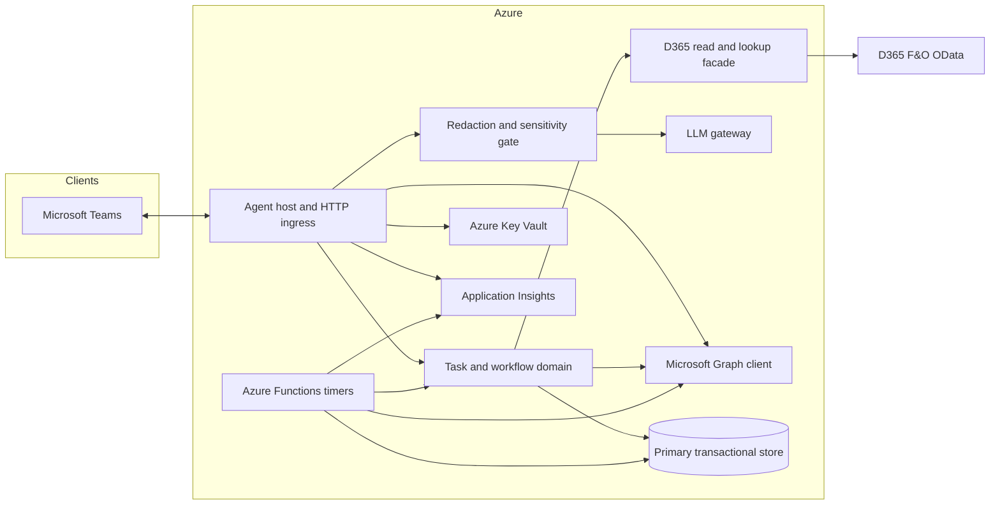

# LTA System Architecture (Pre-Code)

> **Satellite document.** Master program specification: `[LTM_SYSTEM_SPEC.md](LTM_SYSTEM_SPEC.md)` (**LTM** — Lantern Task Manager).

This document defines **logical components**, their **responsibilities**, and the **tools** (services, SDKs, runtimes) planned for each—**before** implementation. It is the architecture counterpart to `docs/LTA_SYSTEM_DECISIONS.md` and informs gap closure in `docs/LTA_GAP_REGISTER.md`.

**Status:** Pre-code. Boundaries may shift during Agents Toolkit scaffolding; update this document when they do.

---

## 1. Scope and assumptions

- **Workload:** ~25 internal users; Teams-first; read-only D365.
- **Delivery spine:** Microsoft 365 Agents Toolkit for agent lifecycle, manifests, and deployment alignment.
- **MVP cost posture:** Prefer **one primary transactional data plane** and **no API Management** unless policy requires it (`LTA_SYSTEM_DECISIONS.md` §7).

---

## 2. Logical context (reference)

---

## 3. Component catalog

Each row is a **deployable or logical boundary** you can map to repos, folders, or Azure resources during implementation.

| ID      | Component                                       | Responsibility                                                                                                                                                                                                                                                                                                          | Tool(s)                                                                                                                                                                                      | Primary interfaces                                                                             |
| ------- | ----------------------------------------------- | ----------------------------------------------------------------------------------------------------------------------------------------------------------------------------------------------------------------------------------------------------------------------------------------------------------------------- | -------------------------------------------------------------------------------------------------------------------------------------------------------------------------------------------- | ---------------------------------------------------------------------------------------------- |
| **C01** | **Microsoft Teams & Adaptive Cards**            | User chat, @mentions, card interactions, task UX.                                                                                                                                                                                                                                                                       | Microsoft Teams client; Adaptive Cards schema (JSON).                                                                                                                                        | Users; Bot Framework activities to **C02**.                                                    |
| **C02** | **Agent host and HTTP ingress**                 | Receive Teams activities, route dialogs, orchestrate toolkit agent, correlate telemetry.                                                                                                                                                                                                                                | **Microsoft 365 Agents Toolkit**; Bot Framework / Cloud Adapter (as provided by toolkit); host process (e.g. **Azure App Service** Linux + Python 3.12, or toolkit-recommended host).        | HTTPS from Teams / Azure Bot Service; calls **C03**–**C09**.                                   |
| **C03** | **Microsoft Graph integration**                 | Resolve users for directory-backed pickers; proactive 1:1; optional profile fields for cards.                                                                                                                                                                                                                           | **Microsoft Graph REST**; **MSAL** (delegated and/or app-only per operation); language SDK as chosen with toolkit.                                                                           | Graph API; tokens from **C08**.                                                                |
| **C04** | **Identity binding and mentions**               | Map activity sender and @mentions to **Entra object ID**; never persist assignee from raw NL alone.                                                                                                                                                                                                                     | Bot Framework activity entities; **C03** for Graph fallback lookup.                                                                                                                          | **C02**, **C05**, **C06**.                                                                     |
| **C05** | **Task and workflow domain**                    | Task CRUD, lifecycle state machine, manager verification routing, escalation rules application, shared **validation** for NL-derived and form payloads.                                                                                                                                                                 | Application code (Python domain module); state rules from config (`task_catalogue`, `manager_map`, `escalation_rules`).                                                                      | **C06**, **C07**, **C09**, **C03**; emits cards via **C02**.                                   |
| **C06** | **Primary transactional store**                 | Tasks, audit trail, idempotency keys for timers, optional short conversation context for UX (not long LLM training corpora); optional **TTL/archival** for conversation slices per retention policy.                                                                                                                    | **Interim (2026-05-20):** **Turso Cloud** (remote `libsql`). **Target:** **Azure SQL Database** when budget approved; **scale-up path:** **Azure Cosmos DB for NoSQL** if triggers in `LTA_SYSTEM_DECISIONS.md` §7 fire. See `docs/LTA_COMPONENT_TECH_STACK.md` and `docs/specs/2026-05-20-turso-database-design.md`. | REST / SDK from **C02**, **C05**, **Fn**.                                                      |
| **C07** | **D365 read and lookup facade**                 | Client credentials OAuth; OData calls; **429 backoff**; **pagination** (`$top` + nextLink); **cross-company / `dataAreaId`** as per-entity config; **no** ad-hoc OData exposed to the LLM—only named lookups.                                                                                                           | **httpx** (async); **MSAL** client credentials; D365 environment base URL from config.                                                                                                       | OData to D365; typed methods consumed by **C05** and **C09**.                                  |
| **C08** | **Secrets and configuration**                   | Client secrets, API keys, model deployment names; non-secret app settings.                                                                                                                                                                                                                                              | **Azure Key Vault**; **managed identity** on App Service / Functions; App Service / Function **application settings** for non-secrets.                                                       | **C02**, **C07**, **C09**, **Fn**.                                                             |
| **C09** | **LLM gateway**                                 | Call primary (Anthropic), fallback (Azure OpenAI), and optional **Groq** (OpenAI-compatible API) for **testing** when configured; timeouts; circuit breaker; return structured tool calls or errors. **Optional later:** “draft-only” NL mode.                                                                          | **anthropic** SDK; **openai** SDK (Azure OpenAI + Groq-compatible base URL); config keys `ANTHROPIC_MODEL_ID`, Azure deployment env vars, `GROQ_API_KEY`.                                    | Invoked only after **C10**; uses **C07** via tools implemented in app (not raw URLs in model). |
| **C10** | **Redaction and sensitivity gate**              | Central policy: replace sensitive segments with placeholders before **C09** and selected logs; maintain mapping to real values only in **C06**; **sensitivity taxonomy** maintained in the policy file and co-owned with HR/Security. Unredacted views (support) restricted by **Entra app roles** (roles TBD with IT). | Policy file (YAML/JSON) + Python module; Entra ID **app roles** for privileged readers.                                                                                                      | **C02** / **C05** on outbound to **C09**; optional **C11** for log scrubbing where applicable. |
| **C11** | **Observability and FinOps signals (optional)** | When enabled: traces, failures, latency; **custom metrics/events** (e.g. NL vs form); telemetry **retention** per CEO-approved policy. **Not** required for MVP—host log stream and diagnostic logs suffice.                                                                                                            | **Application Insights** (optional); structured logging to host diagnostics always.                                                                                                          | Components when adopted; alert rules TBD with owner.                                           |
| **C12** | **Scheduled jobs**                              | Daily task summary, overdue escalation, optional D365 reference cache refresh.                                                                                                                                                                                                                                          | **Azure Functions** (Python 3.12, **Consumption** Y1 or equivalent); **Timer triggers**; same managed identity pattern as app.                                                               | **C06**, **C03**, optional **C11**; optional **C13**.                                          |
| **C13** | **Optional reliability queue**                  | Decouple timer bursts or retry proactive sends (only if needed after load review).                                                                                                                                                                                                                                      | **Azure Queue Storage** (low cost).                                                                                                                                                          | **C12** ↔ workers (could be same Function app with queue trigger).                             |
| **C14** | **Structured task capture (forms)**             | Adaptive Card-based or task module forms; same validation pipeline as NL path (**C05**).                                                                                                                                                                                                                                | Adaptive Cards `Input.`*; optional Teams **Task Modules**.                                                                                                                                   | **C01**–**C02**–**C05**.                                                                       |
| **C15** | **CI/CD and environments**                      | Build, test, deploy; separate dev/staging/prod config.                                                                                                                                                                                                                                                                  | **GitHub Actions**; Agents Toolkit CLI/tasks as primary; separate Azure **resource groups** or subscriptions per environment per policy.                                                     | Repositories; Azure deployment targets.                                                        |
| **C16** | **Local developer workstation**                 | F5 debug, tunnel, local settings.                                                                                                                                                                                                                                                                                       | **Teams Toolkit / Agents Toolkit** dev loop; **Dev Tunnels** (or toolkit-default tunnel); local `.env` (never committed).                                                                    | Developer machine to **C02** (remote) or local emulator if used.                               |
| **C17** | **Backup and DR (MVP)**                         | Protect task/audit data and config references.                                                                                                                                                                                                                                                                          | **Turso (interim):** platform PITR / branching. **Azure SQL (target):** PITR / automated backups per SKU; optional LTR to Blob. **Cosmos** if used for **C06**: continuous backup / PITR per product. Optional export jobs to Blob.                   | **C06**; operator runbook (see gap register Operations).                                       |
| **C18** | **Operational governance hooks**                | Owner/developer responsibilities surfaced as concrete artifacts: config in Git with PR, budget alerts; optional **quarterly access review** cadence with CEO delegate.                                                                                                                                                  | **Azure Cost Management** budgets/alerts; **Git** history for `manager_map` / catalogues; Entra **enterprise application** owners.                                                           | CEO delegate + developer.                                                                      |
| **C19** | **Operational runbooks (living documentation)** | Procedural coverage for manager changes, leavers, wrong verification, D365 secret rotation, incident response—**content** owned by developer + owner per `LTA_SYSTEM_DECISIONS.md` §9.                                                                                                                                  | Markdown (or internal wiki) under `docs/runbooks/` (path TBD at repo creation).                                                                                                              | People + Azure portal + **C08**.                                                               |

---

## 4. Component–tool summary (quick scan)

| Tool / service                                                     | Components           |
| ------------------------------------------------------------------ | -------------------- |
| Microsoft 365 Agents Toolkit                                       | C02, C16             |
| Microsoft Teams + Adaptive Cards                                   | C01, C14             |
| Microsoft Graph + MSAL                                             | C03, C04, C07, C08   |
| Azure App Service (Linux, Python 3.12)                             | C02                  |
| Azure Functions (timer, Python)                                    | C12                  |
| Azure SQL Database (C06 target)                                    | C06, C17             |
| Turso Cloud (C06 interim)                                          | C06, C17             |
| Azure Cosmos DB (scale-up option)                                  | C06 (alternate), C17 |
| Azure Key Vault + managed identity                                 | C08                  |
| Application Insights (optional)                                    | C11                  |
| Azure Queue Storage (optional)                                     | C13                  |
| Anthropic + Azure OpenAI + Groq (OpenAI-compatible, optional) SDKs | C09                  |
| httpx + OData (D365)                                               | C07                  |
| GitHub Actions                                                     | C15                  |
| Azure Cost Management                                              | C18                  |

---

## 5. Gap coverage (architecture recognition)

The following gap-register themes are **recognized by component design** in this document (closure at architecture level; implementation still required).

| Gap theme                                       | How architecture addresses it                                                                                                           |
| ----------------------------------------------- | --------------------------------------------------------------------------------------------------------------------------------------- |
| Entra-first identity, @mentions, disambiguation | **C04** + **C03** + **C05** confirmation path; no D365-only user binding.                                                               |
| M365 Agents Toolkit                             | **C02**, **C16**.                                                                                                                       |
| Structured manual capture + shared validation   | **C14** + **C05**.                                                                                                                      |
| LLM failover / “Continue with form”             | **C09** + **C14**; user-visible fallback path in **C02**.                                                                               |
| D365 not agent-facing as raw OData              | **C07** named lookups; **C09** tools call app code only.                                                                                |
| Throttling / pagination / cross-company         | **C07** (backoff, `$top`/nextLink, per-entity filter config).                                                                           |
| Redaction + sensitivity taxonomy home           | **C10** policy file + module; real values in **C06** only.                                                                              |
| Cost-conscious footprint                        | **C06** SQL MVP; **C12** Consumption; APIM omitted; **C13** optional.                                                                   |
| Graph / proactive                               | **C03**; permissions and runbook detail remain tenant-specific (see `LTA_SYSTEM_DECISIONS.md` §8).                                      |
| Telemetry NL vs form                            | **C11** (when enabled) custom events from **C05**.                                                                                      |
| CI/CD and dev/prod separation                   | **C15**, **C16**.                                                                                                                       |
| Backup / cost of Functions / budget alerts      | **C17**, **C12** + **C13**, **C18**.                                                                                                    |
| Config versioning                               | **C18** Git for config artifacts.                                                                                                       |
| Runbook procedures                              | **C19** scope and ownership; prose filled at go-live.                                                                                   |
| Sensitive-field taxonomy                        | **C10** policy file is the system-of-record location; field list co-owned with HR/Security.                                             |
| Retention (conversation vs audit)               | **C11** telemetry retention when enabled; **C06** row TTL/archival for optional conversation slices—values set per CEO policy.          |
| Subprocessor / region                           | **C09** endpoint and Azure resource **region** choices are configuration-driven; legal/subprocessor sign-off out of scope for this doc. |
| User-facing privacy summary (optional)          | **C01** / **C02** welcome or help card linking to internal policy.                                                                      |
| Draft-only NL (optional)                        | **C09** extension path; same **C14** persistence gate.                                                                                  |

---

## 6. Relation to other documents

| Document                                       | Role                                                                  |
| ---------------------------------------------- | --------------------------------------------------------------------- |
| `docs/LTM_SYSTEM_SPEC.md`                      | **Master** system specification (source of truth).                    |
| `docs/_archive/CLAUDE_1.md`                    | Archived historical baseline.                                         |
| `docs/LTA_TECHNICAL_REQUIREMENTS.md`           | Behavioral **Must/Should/May** requirements; maps to **C01**–**C19**. |
| `docs/LTA_COMPONENT_TECH_STACK.md`             | Per-component **stack** (SDKs, frameworks, Azure).                    |
| `docs/LTA_SYSTEM_DECISIONS.md`                 | Normative decisions.                                                  |
| `docs/LTA_GAP_REGISTER.md`                     | Gaps and `✅` status (updated when architecture recognizes closure).   |
| `docs/LTA_ARCHITECTURE_PRECODE.md` (this file) | Components and tools pre-code.                                        |

---

## Document control

| Version | Date       | Notes                                                                |
| ------- | ---------- | -------------------------------------------------------------------- |
| 0.1     | 2026-05-03 | Initial pre-code component catalog and gap coverage map.             |
| 0.2     | 2026-05-03 | C10/C11 retention and RBAC; C19 runbooks; expanded §5 gap coverage.  |
| 0.4     | 2026-05-03 | Linked `LTA_TECHNICAL_REQUIREMENTS.md` in §6 document relations.     |
| 0.5     | 2026-05-03 | Linked `LTA_COMPONENT_TECH_STACK.md` in §6.                          |
| 0.7     | 2026-05-03 | §6 master spec `LTM_SYSTEM_SPEC.md`; satellite banner; archive link. |