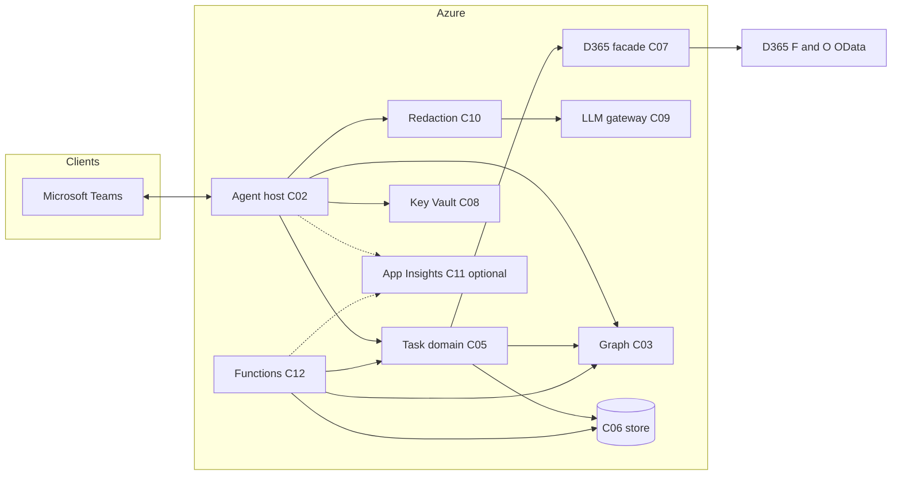
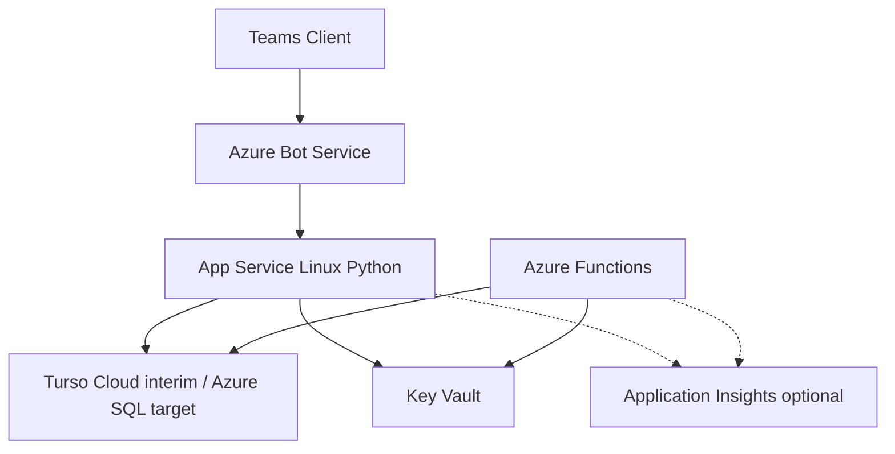

# Lantern Task Manager (LTM) — System Specification

> Recovery note (2026-07-18): this document records the pre-recovery target architecture. Where it conflicts with executable code, `README.md` and the restored implementation are authoritative. Scheduled jobs now run through protected App Service HTTP routes rather than the legacy Azure Functions scaffold.

**Program name:** **LTM** — *Lantern Task Manager* (Microsoft Teams operational task lifecycle for Lantern Systems Company).

**Audience:** Developers (technical).

**Role of this document:** Single **source of truth** for the program. Detailed norms, requirements, architecture decomposition, stack choices, and gap tracking live in **satellite** files under `docs/`; this spec defines scope, behavior, examples, and roadmap, and **binds** those satellites.

**Supersedes:** Root `CLAUDE_1.md` (moved to `[docs/_archive/CLAUDE_1.md](_archive/CLAUDE_1.md)`).

---

## 1. Satellite documents (authoritative detail)


| Satellite                     | Path                                                             | Contents                                                                |
| ----------------------------- | ---------------------------------------------------------------- | ----------------------------------------------------------------------- |
| Normative decisions           | `[LTA_SYSTEM_DECISIONS.md](LTA_SYSTEM_DECISIONS.md)`             | Identity, toolkit, D365 methodology, cost posture, privacy principles.  |
| Behavioral requirements       | `[LTA_TECHNICAL_REQUIREMENTS.md](LTA_TECHNICAL_REQUIREMENTS.md)` | Must / Should / May requirements with IDs.                              |
| Pre-code architecture         | `[LTA_ARCHITECTURE_PRECODE.md](LTA_ARCHITECTURE_PRECODE.md)`     | Components **C01**–**C19**, interfaces, mermaid context.                |
| Component tech stack          | `[LTA_COMPONENT_TECH_STACK.md](LTA_COMPONENT_TECH_STACK.md)`     | SDKs, Azure services, libraries per component.                          |
| Gap register                  | `[LTA_GAP_REGISTER.md](LTA_GAP_REGISTER.md)`                     | Gaps, severity, closure status.                                         |
| D365 data dictionary (future) | `[D365_DATA_DICTIONARY.md](D365_DATA_DICTIONARY.md)`             | Validated entities, fields, OData patterns (stub until admin sign-off). |


---

## 2. Problem statement and scope

LTM is an **AI-assisted** Microsoft **Teams** bot that **manages the lifecycle** of operational tasks across **five departments** (~25 staff). Staff execute real work **outside** the bot (banks, signatures, ERP transactions). The bot **does not** write to Dynamics 365 Finance & Operations; D365 is **read-only** for lookups that enrich tasks and cards.

**In scope:** create, assign, confirm, track, daily reminders, overdue escalation, assignee closure notes, manager verification, optional D365-linked context, structured fallback when LLMs fail.

**Out of scope:** performing ERP postings, replacing D365 workflows, or acting as system of record for financial transactions.

---

## 3. Core principles

1. **Tasks, not transactions** — LTM tracks whether agreed operational work was completed and verified, not the ERP posting itself.
2. **D365 read-only** — OAuth2 client credentials; no OData writes from application code.
3. **Human verification** — Assignee signals completion; **manager** confirms or rejects via Adaptive Card.
4. **NL in, structured out** — Users describe work in English; models propose structured fields; **confirmation** and **shared validation** apply to NL and form paths alike.
5. **Accountability** — Scheduled **daily summary** of pending work; **overdue escalation** per configurable thresholds.

---

## 4. Runtime context (reference)

| Item               | Value / note                                                                                                                                     |
| ------------------ | ------------------------------------------------------------------------------------------------------------------------------------------------ |
| Users              | ~25; Finance, Procurement, Projects, HR & Admin, IT & Systems                                                                                    |
| D365 F&O           | Cloud, UAE-oriented deployment; example base URL `https://lss-prod.operations.uae.dynamics.com` — **confirm with admin**                         |
| Legal entity       | `dataAreaId` example `lsss` — **confirm with admin**                                                                                             |
| Hosting            | Azure (organization subscription)                                                                                                                |
| Canonical user key | **Microsoft Entra ID** (Teams / Bot Framework identity), not D365 personnel number — see `[LTA_SYSTEM_DECISIONS.md](LTA_SYSTEM_DECISIONS.md)` §2 |
| Delivery spine     | **Microsoft 365 Agents Toolkit** — see `[LTA_COMPONENT_TECH_STACK.md](LTA_COMPONENT_TECH_STACK.md)` **C02**                                      |

---

## 5. Logical architecture



**Deployment sketch (high level):**



---

## 6. Components (summary)

Logical components **C01**–**C19** are defined in `[LTA_ARCHITECTURE_PRECODE.md](LTA_ARCHITECTURE_PRECODE.md)` §3. **Stack** per component: `[LTA_COMPONENT_TECH_STACK.md](LTA_COMPONENT_TECH_STACK.md)`. **Behavioral requirements** mapped to **C***: `[LTA_TECHNICAL_REQUIREMENTS.md](LTA_TECHNICAL_REQUIREMENTS.md)` §15.

---

## 7. Dynamics 365 integration (summary)

- **Auth:** MSAL client credentials; secrets in Key Vault; read-only service principal on published data entities only.
- **Access pattern:** Application code exposes **named lookups** (typed internal API); **no** raw OData URL assembly inside LLM prompts. Retries with backoff on **429** and transient errors.
- **Truth:** Entity sets, filters, and columns are validated with the **D365 administrator** and documented in `[D365_DATA_DICTIONARY.md](D365_DATA_DICTIONARY.md)` when ready.
- **Historical samples** (tables, sample `$filter` strings): archived baseline `[_archive/CLAUDE_1.md](_archive/CLAUDE_1.md)` — treat as **non-authoritative** until reconciled with `$metadata`.

---

## 8. Task lifecycle and identifiers

### States

```txt
CREATED → ASSIGNED → IN_PROGRESS → PENDING_CLOSURE → PENDING_VERIFICATION → VERIFIED (terminal)
                                                                          → REOPENED → IN_PROGRESS
                  → CANCELLED (terminal, requester-only from applicable states)
OVERDUE is a boolean flag, not a separate state.
```

### Task ID

`LTM-{DEPT}-{YEAR}-{SEQ}` — example `LTM-FIN-2026-0001`

- **DEPT:** `FIN`, `PROC`, `PROJ`, `HR`, `IT`
- **SEQ:** four-digit zero-padded, unique per department per calendar year

### Logical persistence (normative shape)

Tasks and audit history live in the **C06 primary store**. **Interim operational (2026-05-20):** **Turso Cloud** (remote-only). **Target architecture:** **Azure SQL Database** when budget is approved; **Cosmos DB for NoSQL** scale-up path documented in satellites. See [specs/2026-05-20-turso-database-design.md](specs/2026-05-20-turso-database-design.md). `createdBy` / `assignedTo` / audit actors use **Entra object id** (and cached display fields), **not** D365 personnel number as the sole key.

```json
{
  "id": "LTM-FIN-2026-0001",
  "taskType": "LC Opening",
  "department": "Finance",
  "description": "Open LC for PO-2300001005, Reza Investment Company",
  "status": "IN_PROGRESS",
  "priority": "High",
  "createdBy": {
    "entraObjectId": "aaaaaaaa-bbbb-cccc-dddd-eeeeeeeeeeee",
    "displayName": "User Name",
    "department": "Procurement"
  },
  "assignedTo": {
    "entraObjectId": "ffffffff-gggg-hhhh-iiii-jjjjjjjjjjjj",
    "displayName": "Ahmed Ali",
    "department": "Finance"
  },
  "dueDate": "2026-03-15",
  "createdAt": "2026-03-10T08:30:00Z",
  "updatedAt": "2026-03-12T14:22:00Z",
  "closedAt": null,
  "verifiedAt": null,
  "closureNotes": "",
  "rejectionReason": "",
  "isOverdue": false,
  "escalationCount": 0,
  "lastEscalatedAt": null,
  "d365References": {
    "purchaseOrderNumber": "PO-2300001005",
    "vendorAccount": "V00761",
    "vendorName": "Reza Investment Company Ltd",
    "invoiceNumber": null,
    "customerAccount": null,
    "projectId": null
  },
  "auditTrail": [
    {"event": "CREATED", "actorEntraId": "aaaaaaaa-bbbb-cccc-dddd-eeeeeeeeeeee", "at": "2026-03-10T08:30:00Z", "details": ""},
    {"event": "ASSIGNED", "actorEntraId": "SYSTEM", "at": "2026-03-10T08:30:05Z", "details": "Notified assignee"}
  ]
}
```

Bounded **conversation context** (e.g. last *N* turns per user) **may** be stored in SQL or a dedicated table; retention per CEO-approved policy — see `[LTA_TECHNICAL_REQUIREMENTS.md](LTA_TECHNICAL_REQUIREMENTS.md)` **DM-03**.

---

## 9. AI layer — system prompt (excerpt)

Production text lives in code (`prompts.py`); this excerpt is the **normative intent** (adjust branding in repo to match releases):

```txt
You are the Lantern Task Manager (LTM), an AI assistant managing operational tasks for Lantern Systems Company inside Microsoft Teams.

YOUR ROLE: You CREATE, TRACK, and manage the LIFECYCLE of tasks. You do NOT perform any work. Staff do actual work offline (documents, signatures, bank submissions, etc.).

RULES:
1. Always confirm task details with the user before creating a task.
2. Never fabricate data. Call D365 lookup tools for real reference data.
3. Never claim you can perform operational or ERP activities.
4. When the user mentions PO / vendor / invoice / customer / project — look it up via tools first.
5. Present D365 data as read-only reference in cards.
6. Keep responses concise and action-oriented.
7. For task closure, always ask for completion notes.
8. Requester sets assignee, due date, and priority; do not override.
9. Cross-department assignment is allowed.

TASK STATES: CREATED → ASSIGNED → IN_PROGRESS → PENDING_CLOSURE → PENDING_VERIFICATION → VERIFIED or REOPENED
DEPARTMENTS: Finance, Procurement, Projects, HR & Admin, IT & Systems
PRIORITY: Critical, High, Medium, Low
```

---

## 10. AI tools (names and purpose)

Implementations register these (or a strict subset for MVP) as model-callable tools that delegate to **C07** / **C05** — see `[LTA_COMPONENT_TECH_STACK.md](LTA_COMPONENT_TECH_STACK.md)` **C09**.

| Tool name               | Purpose                                                                                                                                                                             |
| ----------------------- | ----------------------------------------------------------------------------------------------------------------------------------------------------------------------------------- |
| `create_task`           | Propose new task: required task_type, description, assignee resolution, assignee_department, due_date, priority; optional D365 keys (PO, vendor, customer, invoice AP/AR, project). |
| `list_tasks`            | Filter: my_tasks, my_requests, department, all_overdue, pending_verification; optional department, status, limit.                                                                   |
| `close_task`            | Assignee closure with completion_notes → pending verification.                                                                                                                      |
| `get_task_status`       | Fetch by `LTM-…` id or keyword search.                                                                                                                                              |
| `query_d365_po`         | PO by number.                                                                                                                                                                       |
| `query_d365_vendor`     | Vendor by account or name search.                                                                                                                                                   |
| `query_d365_customer`   | Customer by account or name search.                                                                                                                                                 |
| `query_d365_invoice_ap` | AP invoice by number.                                                                                                                                                               |
| `query_d365_invoice_ar` | AR invoice by number or customer.                                                                                                                                                   |
| `query_d365_employee`   | Optional enrichment; **not** canonical identity for Teams users.                                                                                                                    |
| `query_d365_project`    | Project by id or name search.                                                                                                                                                       |

**Model routes (config-driven):** primary **Anthropic**; fallback **Azure OpenAI**; optional **Groq** (OpenAI-compatible API) for **non-production / explicit test configuration** only — see **C09** in stack doc.

**Failover behavior:** circuit breaker / timeouts as configured; when automated NL path is unavailable, user **Must** be offered **validated structured forms** (same rules as NL) — not “queue only.”

---

## 11. Adaptive Card example (task creation confirm)

Minimal **Adaptive Card 1.5** pattern (extend in `cards.py`):

```json
{
  "type": "AdaptiveCard",
  "$schema": "http://adaptivecards.io/schemas/adaptive-card.json",
  "version": "1.5",
  "body": [
    {
      "type": "TextBlock",
      "text": "Confirm new task",
      "weight": "Bolder",
      "size": "Medium"
    },
    {
      "type": "FactSet",
      "facts": [
        { "title": "Task ID", "value": "LTM-FIN-2026-0001" },
        { "title": "Type", "value": "LC Opening" },
        { "title": "Assignee", "value": "Ahmed Ali (Finance)" },
        { "title": "Due", "value": "2026-03-15" },
        { "title": "Priority", "value": "High" },
        { "title": "PO", "value": "PO-2300001005" }
      ]
    },
    {
      "type": "TextBlock",
      "text": "Open LC for PO-2300001005 — D365 data is read-only reference.",
      "wrap": true
    }
  ],
  "actions": [
    {
      "type": "Action.Submit",
      "title": "Confirm",
      "data": { "verb": "confirm_task", "taskId": "LTM-FIN-2026-0001" }
    },
    {
      "type": "Action.Submit",
      "title": "Edit",
      "data": { "verb": "edit_task", "taskId": "LTM-FIN-2026-0001" }
    },
    {
      "type": "Action.Submit",
      "title": "Cancel",
      "data": { "verb": "cancel_draft", "taskId": "LTM-FIN-2026-0001" }
    }
  ]
}
```

**Card builders (code modules):** `task_creation_confirm_card`, `task_assignment_card`, `daily_popup_card`, `manager_verification_card`, `overdue_escalation_card`, `task_status_card` — each returns Adaptive Card JSON.

---

## 12. Workflows (narrative)

1. **Create:** NL or form → model/tools propose fields → D365 validation if refs → **confirm card** → persist `CREATED`/`ASSIGNED` → notify assignee (Graph proactive / activity reply per context).
2. **Daily summary:** Timer (e.g. 07:00 UTC for 10:00 AST) → query open tasks by assignee → proactive 1:1 card sorted by overdue and priority.
3. **Close:** Assignee invokes close with notes → `PENDING_VERIFICATION` → manager card **Confirm** / **Reject + reason** → `VERIFIED` or `REOPENED`.
4. **Escalation:** Timer (e.g. 07:15 UTC) → overdue in `IN_PROGRESS` → notify manager → department head → CEO delegate per `escalation_rules.json`.

Exact schedules and query filters: `[LTA_TECHNICAL_REQUIREMENTS.md](LTA_TECHNICAL_REQUIREMENTS.md)` and config artifacts.

---

## 13. Configuration artifacts

| File                           | Role                                                                                                     |
| ------------------------------ | -------------------------------------------------------------------------------------------------------- |
| `config/task_catalogue.json`   | Task types, default SLA, default priority, suggested D365 ref type per type.                             |
| `config/manager_map.json`      | Reporting lines for verification (maintain **Entra ids** + display metadata per current identity model). |
| `config/escalation_rules.json` | UTC timer cron expressions, overdue day thresholds, actions.                                             |

---

## 14. Repository layout (illustrative)

Align folder names with **Microsoft 365 Agents Toolkit** output; the tree below is a **logical** map (rename `lantern-task-manager` as needed):

```txt
lantern-task-manager/
├── docs/
│   ├── LTM_SYSTEM_SPEC.md          ← this file (master)
│   ├── LTA_*.md                    ← satellites
│   ├── D365_DATA_DICTIONARY.md
│   └── _archive/CLAUDE_1.md
├── app/                            # domain, bot, ai, d365, storage/sql, etc.
├── functions/                      # daily_popup, overdue_escalation, d365_cache_sync
├── config/
├── infra/
├── tests/
├── requirements.txt
└── README.md
```

---

## 15. Azure naming and infrastructure (current direction)

- Resource naming pattern: `**ltm-{resource}-{environment}**` (e.g. `ltm-app-prod`, `ltm-sql-prod`).
- **MVP data plane:** **Turso Cloud** (interim, remote-only) for tasks + audit; **Azure SQL Database** remains the documented target when cost-approved; optional **Cosmos DB** only as documented scale-up.
- **Optional:** API Management, Application Insights — see `[LTA_ARCHITECTURE_PRECODE.md](LTA_ARCHITECTURE_PRECODE.md)` and `[LTA_COMPONENT_TECH_STACK.md](LTA_COMPONENT_TECH_STACK.md)`.

---

## 16. Coding conventions (program-wide)

- **Async** I/O for network and database access (`httpx`, async SQL stack per `[LTA_COMPONENT_TECH_STACK.md](LTA_COMPONENT_TECH_STACK.md)` **C06**).
- **Pydantic v2** for DTOs and external payloads.
- **Type hints** on public functions; docstrings on public APIs.
- **Resilience:** no unhandled exceptions on external dependency failures; structured errors to users.
- **Logging:** structured JSON to host diagnostics; **Application Insights** only when **C11** is enabled.
- **Tests:** `pytest` + `pytest-asyncio`; high coverage on domain and D365 facade modules.
- **Secrets:** Key Vault + managed identity; never commit secrets or populate CI with long-lived passwords where OIDC is available.

---

## 17. Production roadmap (phased)

Phases are **delivery ordering**, not separate products. Gates between phases are: security review, D365 admin sign-off on entities, and UAT sign-off with owner.

| Phase | Name                  | Outcomes                                                                                                                                                                             |
| ----- | --------------------- | ------------------------------------------------------------------------------------------------------------------------------------------------------------------------------------ |
| **1** | Foundation            | Repo + Agents Toolkit scaffold; CI/CD; dev/staging/prod Azure **resource groups**; Entra app registrations (bot, D365 SP, Graph); Key Vault shell.                                   |
| **2** | Teams ingress         | Bot receives activities; health endpoint; structured host logging; identity binding **C04** (Entra id from Teams).                                                                   |
| **3** | Graph & directory     | Graph client; user search for pickers; policy for proactive messaging documented; smoke proactive in non-prod.                                                                       |
| **4** | Task core + SQL       | Schema (Alembic); task CRUD; state machine; `manager_map` / catalogue loaders; unit tests.                                                                                           |
| **5** | Cards & NL/forms      | Adaptive Cards for create/assign/confirm; **shared validation** for NL and structured forms **C14**; no LLM persistence without confirm.                                             |
| **6** | D365 facade           | Read-only OData module **C07**; named lookups; admin-validated entities recorded in `D365_DATA_DICTIONARY.md`.                                                                       |
| **7** | AI stack              | **C10** redaction; **C09** Anthropic + Azure OpenAI + optional Groq test route; tool wiring; circuit breaker + form fallback UX.                                                     |
| **8** | Verification & timers | Manager verification cards; Azure Functions: daily summary + escalation + optional D365 cache sync; E2E tests; **optional C11**; production cutover and runbooks (`docs/runbooks/`). |

---

## 18. Related material

- **Archived baseline (pre-LTM spec):** `[docs/_archive/CLAUDE_1.md](_archive/CLAUDE_1.md)`
- **Gap tracking:** `[LTA_GAP_REGISTER.md](LTA_GAP_REGISTER.md)`

---

## Document control (living)

| Version | Date       | Changelog                                                                                                                                                                                                                        |
| ------- | ---------- | -------------------------------------------------------------------------------------------------------------------------------------------------------------------------------------------------------------------------------- |
| 1.0.0   | 2026-05-03 | Initial master specification: LTM naming, Entra-first task model, SQL MVP, satellites index, mermaid diagrams, prompt excerpt, tool table, Adaptive Card example, eight-phase roadmap; supersedes root `CLAUDE_1.md` (archived). |
